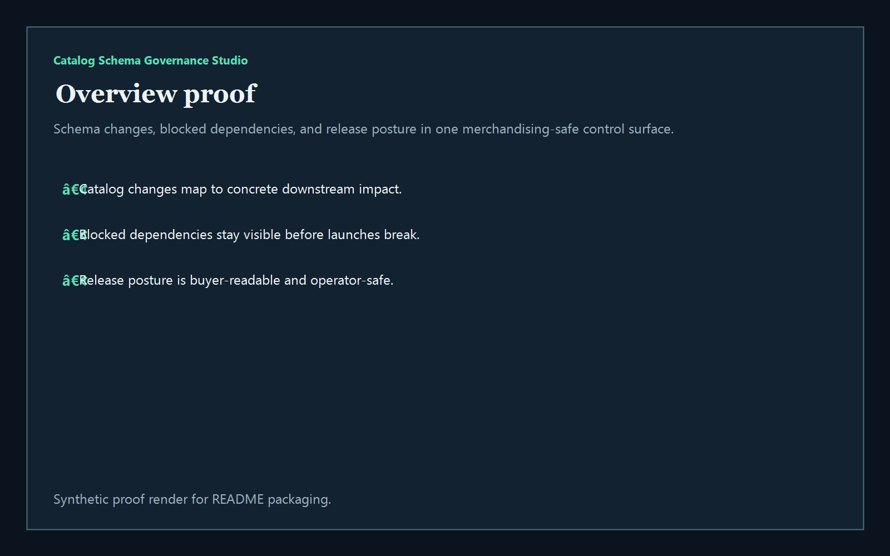
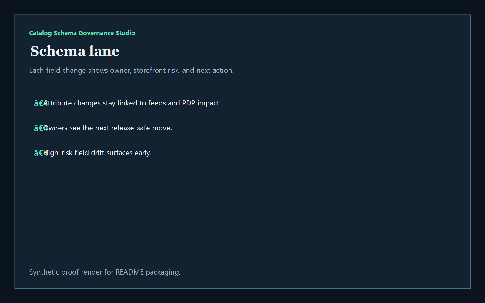
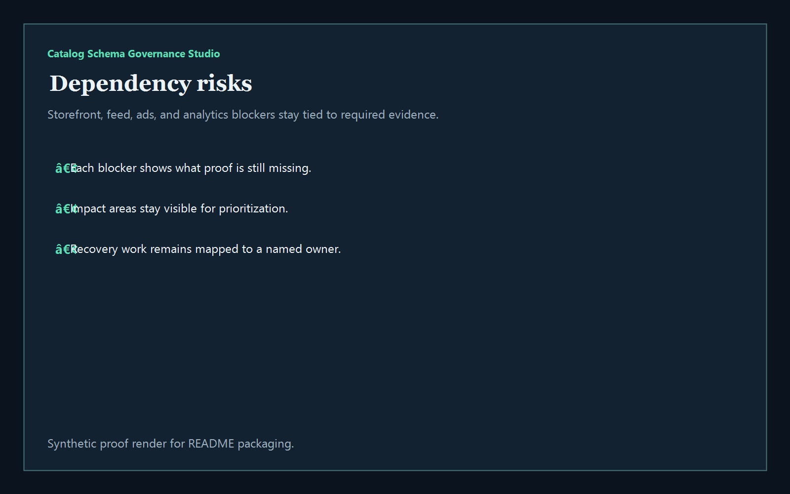
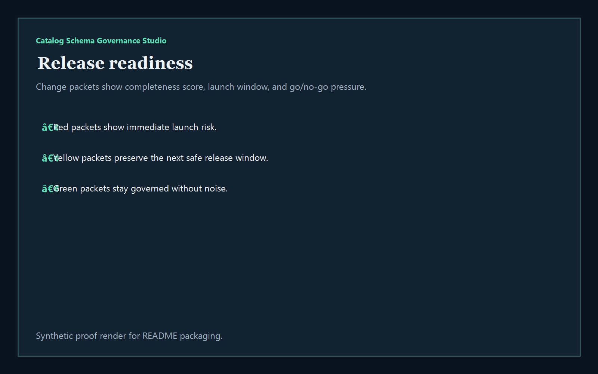

# Catalog Schema Governance Studio

TypeScript studio for catalog schema governance, merchandising dependencies, release-safe attribute changes, and buyer-facing product-data operations.

## Why this exists

- Commerce teams break launches when product attributes, variant rules, and feed mappings drift across systems.
- Merchandising and platform teams need to know which schema change affects storefronts, ads, search feeds, and downstream integrations.
- Retail and eCommerce leaders care whether new fields can ship safely without fragmenting discovery, PDP rendering, or campaign targeting.
- Commerce buyers want operator tooling that turns catalog change chaos into governed releases, ownership, and measurable readiness.

## Why this matters (KG Embedded tie-back)

This repo demonstrates the catalog-schema governance primitive for RetailTech / eCommerce buyers: field changes, dependency blockers, and release posture tied into one operator surface. A B2B SaaS buyer would care because catalog, feed, and merchandising data often need to surface inside customer-facing products without exposing unsafe write paths or fragmented release evidence. Kinetic Gain Embedded extends this into security-first in-product analytics for commerce, data, and merchandising workflows, see [kineticgain.com/embedded](https://kineticgain.com/embedded).

## Routes

- `/`
- `/schema-lane`
- `/dependency-risks`
- `/release-readiness`
- `/verification`
- `/docs`

## API

- `/api/dashboard/summary`
- `/api/schema-lane`
- `/api/dependency-risks`
- `/api/release-readiness`
- `/api/verification`
- `/api/sample`

## Screenshots






## Local Development

```powershell
cd catalog-schema-governance-studio
npm install
npm run dev
```

Open:
- [http://127.0.0.1:5502/](http://127.0.0.1:5502/)
- [http://127.0.0.1:5502/schema-lane](http://127.0.0.1:5502/schema-lane)
- [http://127.0.0.1:5502/dependency-risks](http://127.0.0.1:5502/dependency-risks)
- [http://127.0.0.1:5502/release-readiness](http://127.0.0.1:5502/release-readiness)
- [http://127.0.0.1:5502/verification](http://127.0.0.1:5502/verification)

## Validation

- `npm run build`
- `npm run test`
- `npm run coverage`
- `npm run demo`
- `npm run smoke`
- `npm run prerender`
- `npm run render:assets`

## Docs

- [Architecture](./docs/architecture.md)
- [Origin](./docs/ORIGIN.md)
- [Kinetic Gain Embedded tie-back](./docs/KINETIC_GAIN_EMBEDDED.md)
- [Changelog](./CHANGELOG.md)
